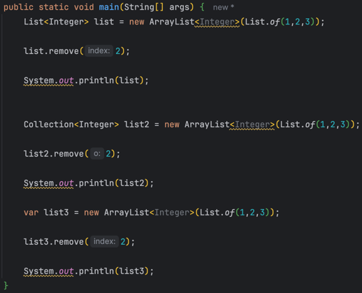

# know-you-java
Code repo based on lecture: Know your Java? By Venkat Subramaniam

# Collection remove()
- Czy klasa `List` posiada metodę `remove` z parametrem `int`? Ma dlatego usuwamy po indeksie
- Czy klasa `Collection` posiada metodę remove z parametrem `int`? Nie (mamy z boxed `Integer`), ale tak się składa, że obiekt jest Inteegerem i nie mamy przeładowania metody

> Polymorphism does not consider the type of the parameters at runtime. That is resolve at compile time.

W Groovy ten kod zachowałby się inaczej.

# Arrays.asList()

`Arrays.asList()` zwraca częściowo niemutowalną listę, nie możemy modyfikować rozmiaru listy, ale jej elementy już tak.

     * 
The returned list implements the optional {@code Collection} methods, except
     * those that would change the size of the returned list. Those methods leave
     * the list unchanged and throw {@link UnsupportedOperationException}.

Wniosek: powinniśmy używać `List.of()` zamiast `Arrays.asList()`, ale trzeba pamiętać, że metody  `of()` nie przyjmują nulli i rzucają `NullPointerException`.

# forEach

Pisane przez nas lambdy (funkcje) nie powinny modyfikować niczego spoza lambdy, powinniśmy używać metody `toList()`

#  

> In languages like Java (and C#, Python) the execution is always lazy

> In languages like Kotlin and Scala you can choose between eager and lazy"

Pisane przez nas funkcje nie powinny:
- modyfikować niczego na zewnątrz
- nie powinna polegaćna niczym co może się zmienić

# inheritance

Nie wykonywać żadnej grubszej logiki w konstruktorach, a w szczególności nie wywoływać virtual functions (funkcje które zostały nadpisane przez poliformizm).

# toList

`toList()` w przeciwieństwie to `Collections.toList()` daje niemodyfikowalną tablicę.

# default condition in switch

> Czy powinniśmy implementować przypadek default?

Nie powinniśmy implementować `default` jeżeli taka sytuacja nie powinna się wydarzyć, chcemy wtedy dostać wyjątek.

# records

avoid canonical constructors as much as possible

Use compact constructor

Think of the compact constructor as a filter or a pre-processor

before the constructor is called.

your code --> compact constructor --> constructorr